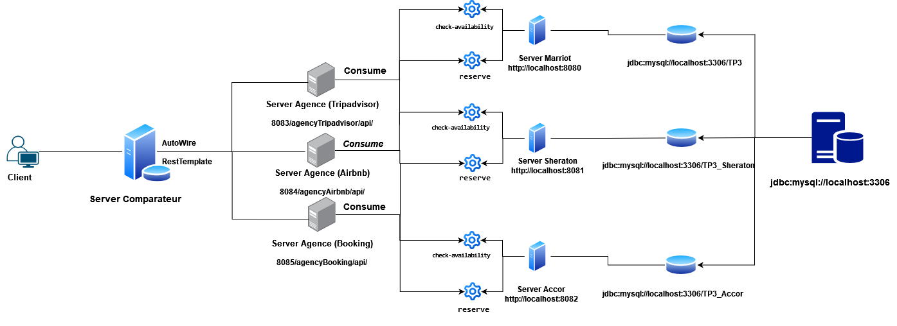

# TP3 Archi_Dis 
## **REST Web Services**

### **Project Overview**
This project is the third assignment (TP3) for the course **HAI704I** at the **University of Montpellier**. It involves implementing a **hotel reservation system** using **REST web services**, which is designed to be scalable and distributed. 

The first step is to replicate the implementation from **TP2**, but using **REST** instead of **SOAP** ([Link to TP2 SOAP](https://github.com/malik-mnsr/TP2_Archi_Dis_SOAP)).

Additionally, a **web service** will be created to **compare prices** from different agencies and display them on the **command-line interface (CLI)**. This will allow clients to choose the best offer before making a reservation.

### **High-Level Architecture**

The implementation is divided into four main parts:

#### **A. Hotel Side**

- **Spring Boot Application**: 
  - Create a **Spring Boot application** using **Spring Initializr** with dependencies: **Spring Web**, **Spring Data JPA**.
- **DataBase**: 
  - Create a **Sql** using **phpmyadmin** cause we want the data **persistence**.

  
- **Project Structure**: 
  - Create packages: **Controller**, **Data**, **Exceptions**, **Main**, **Model**, **Repository**.
  
- **Repositories**: 
  - Implement repositories for handling data, including **HotelRepo**, **HotelAvailabilityRepo**, and **HotelReservationRepo**.
  
- **Web Services**: 
  - Implement **REST APIs** for CRUD operations (GET/POST/PUT/DELETE) related to hotel availability and reservations:
    - **HotelAvailabilityController**: Provides availability data.
    - **ReservationController**: Handles reservations.
  
- **Testing**: 
  - Use **Postman** to test the following API endpoints:
    - `AvailabilityService/api/check-availability`
    - `ReservationService/api/make-reservation`
  
  Ensure that both services return a **200 OK** response.

#### **B. Agency Side**

- **Spring Boot Application**:
  - Create another **Spring Boot application** with dependencies: **Spring Web**, **Spring Data JPA**, and **H2 Database**.
  
- **Project Structure**:
  - Similar to the hotel side, create packages: **Controller**, **Data**, **Exceptions**, **Main**, **Model**, **Repository**, and **Client**.
  
- **Web Services**: 
  - Implement **REST APIs** for CRUD operations (GET/POST/PUT/DELETE) to interact with the hotel web services. The agency side will query hotel services for data and present it to clients:
    - `agency('HOTEL_NAME')/api/check-availability`
    - `agency('HOTEL_NAME')/api/reserve`
  
- **Testing**: 
  - Use **Postman** to ensure that the agency is successfully querying the hotel services for availability and reservations.

#### **C. Comparator Side**

- **Spring Boot Application**:
  - Create a third **Spring Boot application** with dependencies: **Spring Web**, **Spring Data JPA**, and **H2 Database**.
  
- **Database**:
  - This database will store **client information**, and users will need to **authenticate** to use the comparator service.

- **Comparator Service**:
  - The service will prompt the user to input their details, then request offers from various agencies. After processing the information, the service will present the client with a list of offers from different agencies, where the same room may have different prices.

- **Reservation from Comparator**:
  - Once the client selects an offer, the **Comparator service** will identify the **right agency** based on the selected offer and call the corresponding agency's reservation service to book the room.
  - The **Comparator service** will send a reservation request to the appropriate agency using the following API:
    - `agency('HOTEL_NAME')/api/reserve`
  - The reservation request will include the necessary information such as:
    - Client name and CreditCard
    - Offer ID
    - Selected dates
    - Number of persons
  - Once the reservation is processed, the **Comparator service** will return a confirmation to the client, including:
    - **Reservation ID**
    - **Reservation details** (hotel, room type, dates, price)
    - **Reservation status**

#### **D. Client Side**

- **Authentication**:
  - Clients authenticate by entering their **phone number** and **email**, which then allows them to access the comparator service and receive offers from different agencies.

### **Prerequisites**

Ensure you have the following tools installed:
- **Java (JDK 11 or higher)**
- **Spring Boot**
- **Postman** for testing API endpoints
- **H2 Database** (for the Agency and Comparator services)
- **Phpmyadmin SQL** (For Hotels)  
- **Maven** to install dependcies after cloning the project we should to run `mvn clean` then `mvn package`

### **Execution**

To run the system:
1. Start the **Hotel service**.
2. Start the **Agency service**.
3. Start the **Comparator service**.
4. Use the **CLI** or **Postman** to interact with the services.

For any issues or bugs, ensure to check the **Postman responses** and the **logs** for errors.

###### **MANSOUR Malik M1 GL Montpellier, 23/11/2024**
